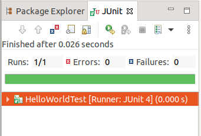

## Vim, Java, Ant 和 Junit 自学报告
### [返回目录](../GridWorld-Catalog)

### 环境

- Ubuntu 18.04.2 LTS

### 1. vim 安装与使用
- 安装
    ```
    sudo apt-get install vim
    ```
- 基本使用
    - ``vim test.txt``创建文本
    - 按 ``i`` 从正常模式进入插入模式
    - 按 ``esc`` 从插入模式返回正常模式
    - 输入 ``:wq`` 保存并退出，其中 ``w`` 表示保存 ``q`` 表示退出
    - 如果没有输入 ``w``，则退出时文件不会保存在目录下

### 2. Java 安装与使用
#### 2.1 JDK 安装
- [官网下载](https://www.oracle.com/technetwork/java/javase/downloads/jdk8-downloads-2133151.html)
- 解压
    ``tar -zxvf jdk-8u231-linux-x64.tar.gz``
- 移动到``/usr/local/``目录下
    ```
    sudo mv jdk1.8.0_231 /usr/local/
    ```
- 配置环境变量
    编辑文件
    ```
    sudo vim ~/.bashrc
    ```
    在末尾添加
    ```
    export JAVA_HOME=/usr/local/jdk1.8.0_231
    export JRE_HOME=${JAVA_HOME}/jre
    export CLASSPATH=.:${JAVA_HOME}/lib:${JRE_HOME}/lib
    export PATH=${JAVA_HOME}/bin:$PATH
    ```
    更新环境变量
    ```
    source ~/.bashrc
    ```
- 检查安装
    ```
    java -version
    ```
- 可能出现的问题
    [如果 ubuntu 已安装了 openjdk](https://blog.csdn.net/itbiggod/article/details/79643725)

#### 2.2 HelloWorld 程序编写
- HelloWorld.java
    ```java
    public class HelloWorld{
        public static void main(String args[]){
            System.out.println("Hello, World!");
        }
    }
    ```
- 编译生成 HelloWorld.class
    ```
    javac HelloWorld.java
    ```
- 运行
    ```
    java HelloWorld
    ```
### 3. Ant 安装与使用
#### 3.1 Ant 安装
- [官网下载](http://ant.apache.org/bindownload.cgi)
- 解压
    ```
    tar -zxvf apache-ant-1.9.14-bin.tar.gz
    ```
- 移动
    ```
    sudo mv apache-ant-1.9.14 /usr/
    ```
- 配置环境变量  
    - 编辑文件
        ```
        sudo vim ~/.bashrc
        ```
    - 在末尾添加
        ```
        export ANT_HOME=/usr/apache-ant-1.9.14
        export PATH=$PATH:$ANT_HOME/bin
        ```
    - 更新环境变量
        ```
        source ~/.bashrc
        ```
- 检查安装
    ```
    ant -version
    ```
#### 3.2 [Ant 简单使用](http://www.blogjava.net/amigoxie/archive/2007/11/09/159413.html)
- 创建文件结构如下  
    ```
    HelloWorld
        |-- build.xml
        |-- src
            |-- HelloWorld.java
    ```
- 编写 build.xml  
    ```xml
    <?xml version="1.0"?>
    <project name="HelloWorld" default="run" basedir=".">
        <target name="clean">
            <delete dir="build"/>
        </target>

        <target name="compile" depends="clean">
            <mkdir dir="build/classes"/>
            <javac srcdir="src" destdir="build/classes"/>
        </target>

        <target name="run" depends="compile">
            <java classname="HelloWorld">
                <classpath>
                    <pathelement path="build/classes"/>
                </classpath>
            </java>
        </target>
    </project>
    ```
- 在 HelloWorld 目录下运行  
    ```
    ant
    ```
    默认目标是 run ，run 依赖于 compile ， compile 依赖于 clean 。因此首先会清除 build/ 中的内容， 然后编译，最后运行。
### 4. Junit 使用

#### 4.1 [eclipse 中 Junit 使用](https://blog.csdn.net/fulishafulisha/article/details/80158392)
- [ubuntu 中 eclipse 安装](https://www.cnblogs.com/zyrblog/p/8548270.html)
- 用 eclipse 新建工程目录如下
    ```
    HelloWorld
        |--- JRE System Library
        |--- src
              |--- helloWorld
                        |--- HelloWorld.java
        |--- test
              |--- helloWorld
                        |--- HelloWorldTest.java
    ```

- 添加 Junit
    右键工程，点击 Properties -> Java Build Path -> Libraries -> Add Library -> JUnit -> Next -> Finish ，可以看到工程目录下多了 JUnit 5 子目录。

- HelloWorld.java
    ```java
    package helloWorld;
    import java.util.*;

    public class HelloWorld {
        public String getHelloWorld() {
            return "Hello World!";
        }
        
        public static void main(String[] args) {
            HelloWorld hw = new HelloWorld();
            String s = hw.getHelloWorld();
            System.out.println(s);
        }
    }
    ```
- HelloWorldTest.java  
    测试 HelloWorld.java 中的 getHelloWorld 函数  
    ```java
    package helloWorld;
    import static org.junit.Assert.*;
    import org.junit.Test;

    public class HelloWorldTest {
        @Test
        public void testGetHelloWorld() {
            assertEquals("Hello World!", new HelloWorld().getHelloWorld());
        }
        
    }
    ```
- 运行 HelloWorldTest.java  
    测试通过  
    

#### 4.2 使用 Ant 运行 Junit 测试
- 创建文件结构
    ```
    HelloWorld
        |--- src
              |--- helloWorld
                        |--- HelloWorld.java
              |--- HelloWorldTest.java
        |--- build.xml
    ```
- HelloWorld.java
    ```java
    package helloWorld;
    import java.util.*;

    public class HelloWorld {
        public String getHelloWorld() {
            return "Hello World!";
        }
        
        public static void main(String[] args) {
            HelloWorld hw = new HelloWorld();
            String s = hw.getHelloWorld();
            System.out.println(s);
        }
    }
    ```
- HelloWorldTest.java
    ```java
    import helloWorld.HelloWorld;
    import static org.junit.Assert.*;
    import org.junit.Test;

    public class HelloWorldTest {
        @Test
        public void testGetHelloWorld() {
            assertEquals("Hello World!", new HelloWorld().getHelloWorld());
        }
        
    }
    ```
- build.xml  
    注意，由于 HelloWorld 属于包 helloWorld ，所以在 run 中 classname 要设置为 helloWorld.HelloWorld  
    ```xml
    <?xml version="1.0"?>
    <project name="HelloWorld" default="run" basedir=".">
        <path id="compile.path">
            <pathelement location="lib/junit-4.10.jar" />	
        </path>

        <target name="clean">
            <delete dir="build"/>
            <mkdir dir="build/classes"/>
        </target>

        <target name="compile" depends="clean">
            <javac srcdir="src" destdir="build/classes/" classpathref="compile.path" includeantruntime="true">
            </javac>
        </target>

        <target name="run" depends="compile">
            <java classname="helloWorld.HelloWorld" fork="true">
                <classpath path="build/classes">
                </classpath>
            </java>
        </target>

        <target name="junit" depends="compile">
            <junit printsummary="true">
                <classpath path="build/classes/">
                    <path refid="compile.path"/>
                </classpath>
                <batchtest>
                    <fileset dir="src/">
                        <include name="*Test.java" />
                    </fileset>
                </batchtest>
            </junit>
        </target>
    </project>
    ```
- 运行
    ``ant junit``

### 5. [sonarQube 使用](https://se-2019.github.io/resources/sonarqube-tutorial-v1.pdf)

---

[返回目录](../GridWorld-Catalog)