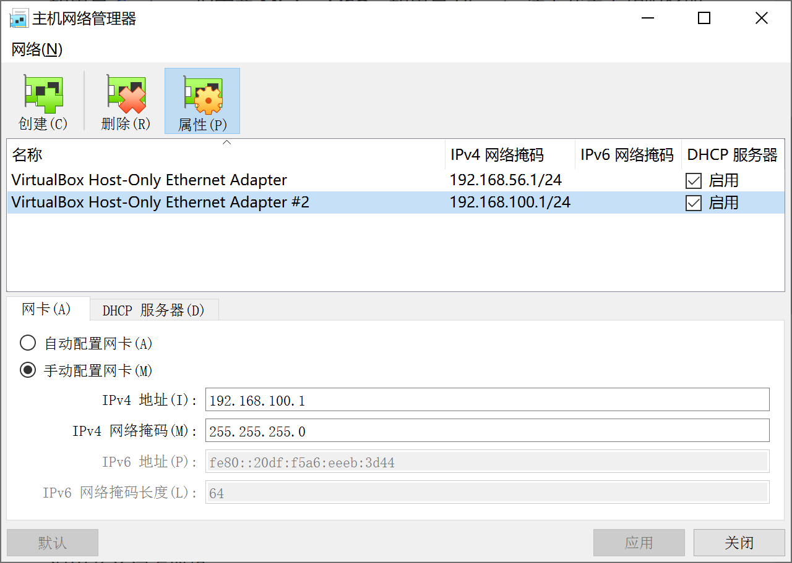
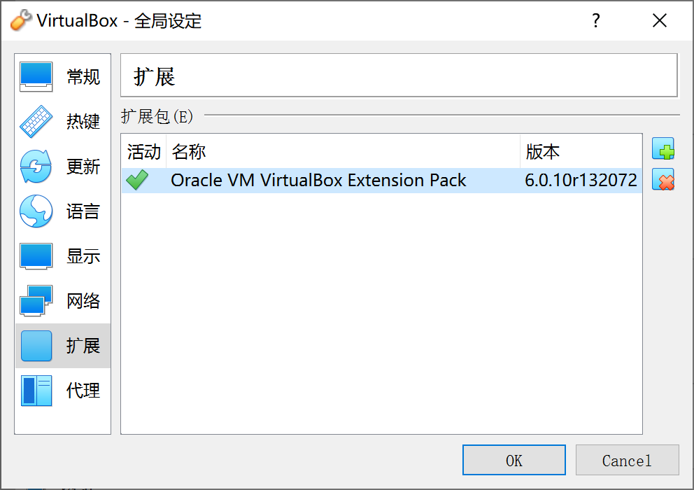

## Win10中使用VirtualBox搭建ubuntu私有云桌面
### [返回目录](../ServiceComputingOnCloud-Catalog)

## 1.实验环境

* Win10
* Oracle VirtualBox
* ubuntu虚拟机

## 2.实验要求

使得用户能使用微软远程桌面，远程访问你在PC机上创建的虚拟机

## 3.实验过程

### 1.下载所需软件

* <a href = "https://www.virtualbox.org/wiki/Downloads" target = "_blank">Oracle VirtualBox (Windows hosts)</a>

* <a href = "https://www.virtualbox.org/wiki/Downloads" target = "_blank">Orcale VM VirtualBox Extension Pack</a>

* <a href = "https://ubuntu.com/download#download" target = "_blank">ubuntu</a>

### 2.安装虚拟机并做网卡配置

#### 1. 利用VBox向导新建虚拟机并安装增强功能

* <a href = "https://blog.csdn.net/Loisleen/article/details/84975165" target = "_blank">安装增强功能失败?</a>

#### 2. 配置网卡

* VirtualBox菜单 -> 管理 -> 主机网络管理器，创建一块虚拟网卡，网址分配：192.168.100.1/24，然后**记得点击启用**  
配置完后，一般情况下总共有两块网卡  

* 选中虚拟机，VirtualBox菜单 -> 控制 -> 设置 -> 网络，其中  
网卡1，默认就是NAT  

新建网卡2，界面名称选择上一步新创建的网卡#2  
  

#### 3. 安装VirtualBox Extension Pack

* VirtualBox菜单 -> 管理 -> 全局设定 -> 扩展 -> 添加新包，选中事先下载好的Extension Pack,  
安装完成后**重启电脑**  
  

#### 4. 启用并测试VirtualBox远程桌面服务功能

* 选中虚拟机，VirtualBox菜单 -> 控制 -> 设置 -> 显示 -> 远程桌面,  
点击启用服务器, 分配服务器端口号  

* 将虚拟机开机，打开Win10自带远程桌面连接, 输入手动配置的IP地址:端口号  
  
点击连接，即可访问  
  

---

[返回目录](..//ServiceComputingOnCloud-Catalog)