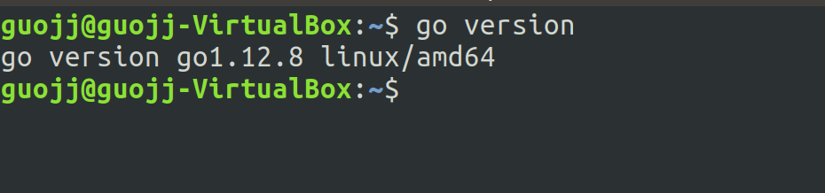
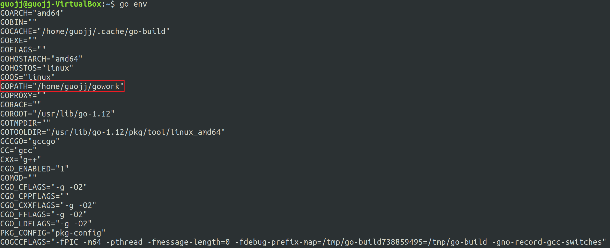
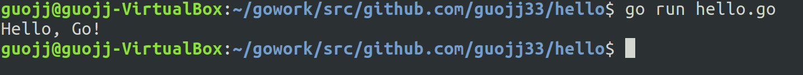
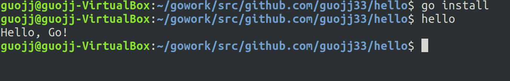
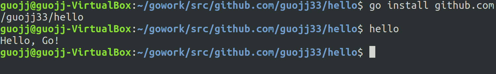
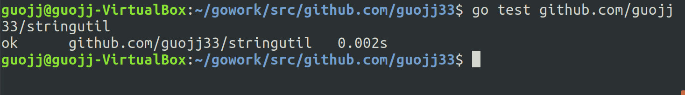

## ubuntu安装go语言开发环境并使用go编程
### [返回目录](../ServiceComputingOnCloud-Catalog)

### 1.安装 go

使用 apt-get install 安装的 go 默认版本较低，安装较新版本的[步骤](https://github.com/golang/go/wiki/Ubuntu)如下

- 获取最新软件包源，并添加至当前的 apt 库  
`$ sudo apt-get-repository ppa:longsleep/golang-backports`  

- 更新 apt 库  
`$ sudo apt-get update `  

- 安装 go  
`$ sudo apt-get install golang-go`  

- 测试安装是否成功  
`$ go version`  



### 2.设置环境变量

- #### 创建工作空间
    go work是工作空间名，可自定义    
    `$ mkdir $HOME/gowork`

- #### 配置环境变量  
    `$ vim ~/.bashrc`  

    `$ export GOPATH = $HOME/gowork`  

    `$ export PATH = $PATH:GOPATH/bin`  

- #### 检查配置
    `$ go env`  
    

### 3.创建 Hello 程序

- 在此之前我将`$GOPATH/src/github.com/user`文件夹更名为了`$GOPATH/src/github.com/guojj33`。  
    guojj33 即我的 github 用户名

- #### 创建源代码目录
    `$ mkdir $GOPATH/src/github.com/guojj33/hello -p`

- #### 创建 hello.go 文件
    ```go
    package main

    import "fmt"

    func main(){
	fmt.Printf("Hello, Go!\n");
    }
    ```

- #### 在终端运行

##### 1. 第一种方法
```
$ cd $GOPATH/src/github.com/guojj33/hello
$ go run hello.go  
```


##### 2. 第二种方法
* 安装
```
$ cd $GOPATH/src/github.com/guojj33/hello
$ go install
```
`$GOPATH/bin` 中将产生 hello 可执行文件

* 运行
```
$ cd $GOPATH/bin
$ hello
```

* 若将 $GOPATH/bin 添加到了 PATH，可以不用 cd 到 bin 而直接运行 hello


### 4.创建库

- #### 创建包目录
    ```
    $ mkdir $GOPATH/src/github.com/guojj33/stringutil
    ```

- #### 创建 reverse.go 文件
    ```go
    // stringutil 包含有用于处理字符串的工具函数。
    package stringutil

    // Reverse 将其实参字符串以符文为单位左右反转。
    func Reverse(s string) string {
        r := []rune(s)
        for i, j := 0, len(r)-1; i < len(r)/2; i, j = i+1, j-1 {
            r[i], r[j] = r[j], r[i]
        }
        return string(r)
    }   
    ```

- #### 编译
    执行
    ```
    $ go build github.com/guojj33/stringutil
    ```
    将不会产生输出文件，要得到输出，执行
    ```
    go install github.com/guojj33/stringutil
    ```
    会将包的对象放到工作空间 pkg 目录中

- #### 在 hello.go 中导入库并使用 Reverse 函数
    ```
    package main

    import (
        "fmt"

        "github.com/guojj33/stringutil"
    )

    func main() {
        fmt.Printf(stringutil.Reverse("\n!oG ,olleH"))
    }
    ```

- #### 运行 hello.go
    ```
    $ go install github.com/guojj33/hello
    $ hello
    ```
    

### 5.创建测试
Go拥有一个轻量级的测试框架，由 go test 命令和 testing 包构成。

通过创建一个名字以 _test.go 结尾的，包含名为 TestXXX 且签名为 func (t *testing.T) 函数的文件来编写测试。 测试框架会运行每一个这样的函数；若该函数调用了像 t.Error 或 t.Fail 这样表示失败的函数，此测试即表示失败

- #### 创建测试文件
    ```
    $GOPATH/src/github.com/guojj33/stringutil/reverse_test.go
    ```

    reverse_test.go  
    ```go
    package stringutil

    import "testing"

    func TestReverse(t *testing.T) {
        cases := []struct {
            in, want string
        }{
            {"Hello, world", "dlrow ,olleH"},
            {"Hello, 世界", "界世 ,olleH"},
            {"", ""},
        }
        for _, c := range cases {
            got := Reverse(c.in)
            if got != c.want {
                t.Errorf("Reverse(%q) == %q, want %q", c.in, got, c.want)
            }
        }
    }
    ```

- #### 运行测试
    ```
    $ go test github.com/guojj33/stringutil
    ```
    

---

[返回目录](..//ServiceComputingOnCloud-Catalog)