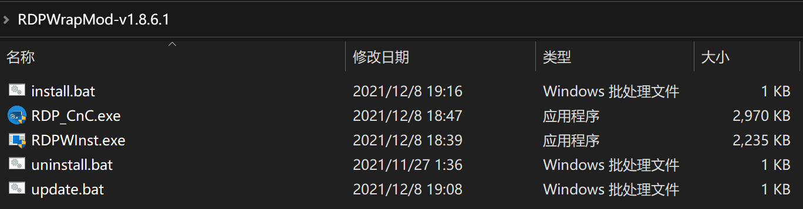
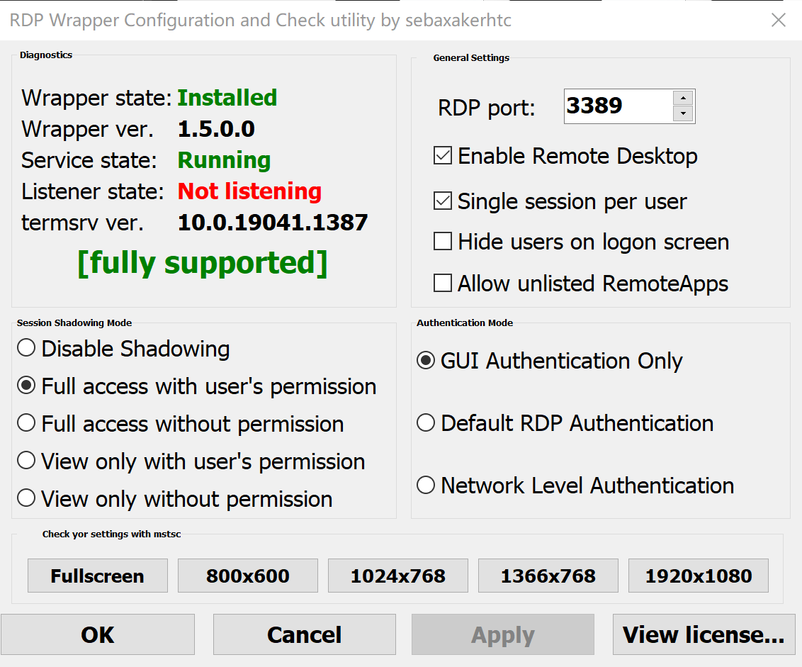

## RDP Warpper 使用

1. 下载[RDP Warpper Zip](https://github.com/sebaxakerhtc/rdpwrap/releases)，运行 `install.bat`
   

2. 下载[rdpwarp.ini](https://github.com/sebaxakerhtc/rdpwrap.ini)，替换到 `C:\Program Files\RDP Wrapper`

3. 运行`RDP_CnC.exe`，显示`full supported`
   