## 游戏介绍 —《[蔚蓝](http://www.celestegame.com/)》
#### [返回目录](../Unity3dLearning-Catalog)
---
### 介绍
《蔚蓝》(英文名Celeste)，是一款由加拿大电子游戏设计师Matt Thorson和Noel Berry所设计开发的平台跳跃游戏，于2018年1月再多个平台上发行。游戏一发行即获得大量好评，IGN给予该作10/10分，成为2018年首款获得该分数的游戏。玩家需要操控一个名叫Madeline的小女孩，利用攀爬，跳跃，突刺三个基本技能，在避免触碰到各种致命障碍的同时向山上进发。

### 特点
#### 1. 像素风格的画面，别具特色。高质量音效配乐，节奏感强。
每一章的音乐与环境和剧情相互照应，配乐的编曲还会随着游戏的进度而改变，例如乐器不断丰富，鼓点增强，代入感十足。甚至还有十分强调节奏准确的关卡。  
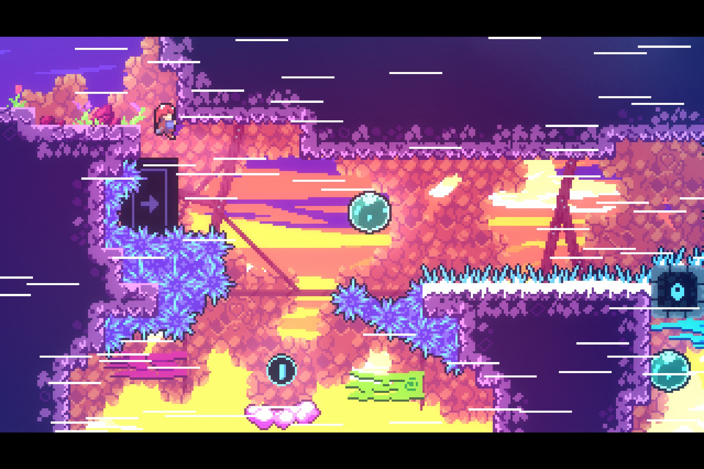  

#### 2. 场景、机关、环境道具丰富。
控制方法简单，但实际操作起来很有挑战性，需要精确把握的位置和时机。除了普通的障碍，游戏中还会遇到“自己的一部分”、幽灵等反派，有一种从跳跃游戏变成战斗游戏的错觉。  
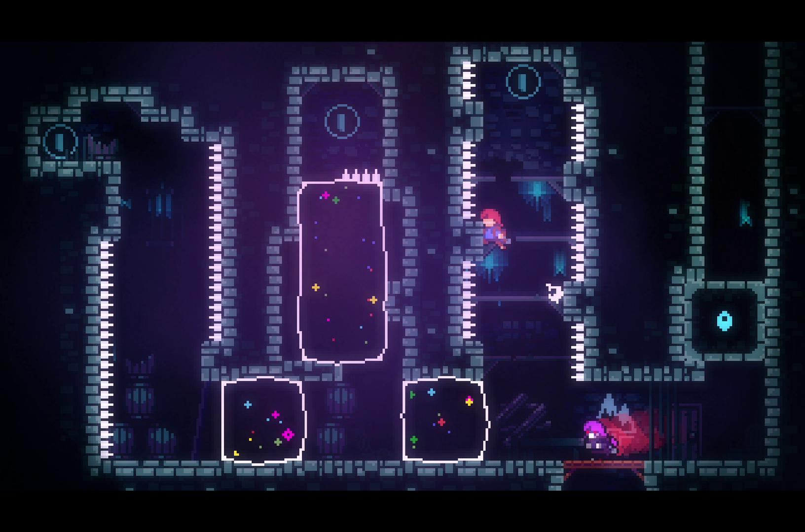
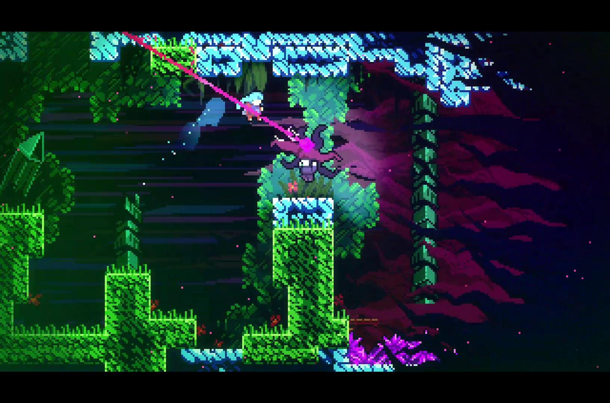

#### 3. 游戏在难度设计上分了多个层级，供玩家选择。  
可以选择帮助模式，快速通关，欣赏配乐和画面。也可以探索破解难度更高的B面、C面和额外章节。  
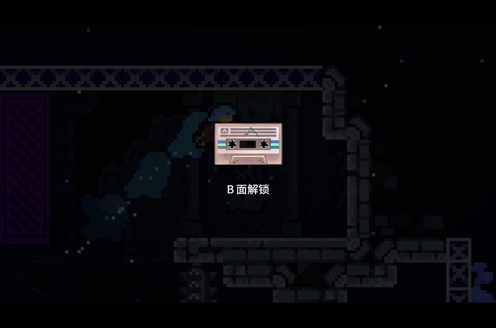

#### 4. 彩蛋丰富，吸引玩家不断探索。  
在游戏中找到并挑战某些关卡，将草莓收入囊中，最终会稍微影响最终的结局。收集磁带，可以解锁章节的B面。游戏的原型Pico-8也作为彩蛋之一供玩家去发现。   
##### Pico-8  
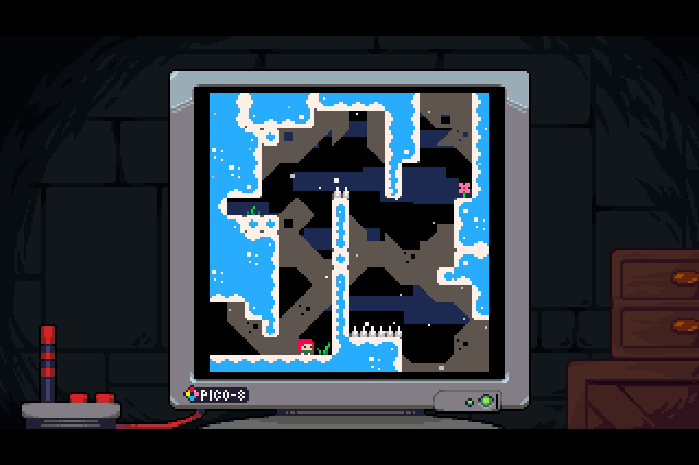  
##### 角色Theo曾提到他的InstaPix账号  
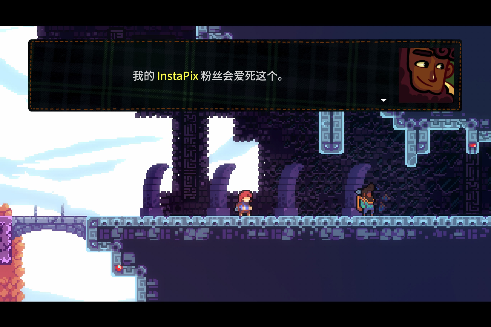  
##### Theo在真实世界中的Instagram账号  
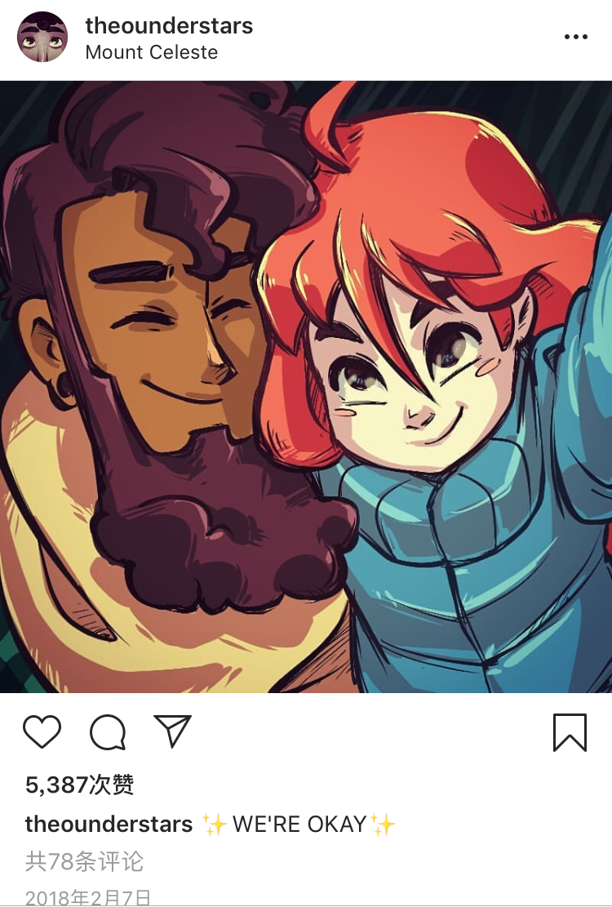  

#### 5. 游戏的剧情富有人文关怀。  
逐渐走到后面的章节时，玩家就会发现这是一个关于抑郁症和恐慌症的故事，面对“可怕”、“愤怒”的“自己的一部分”，作者并不希望Madeline去逃避它，视其为自己的累赘，而是接受它。最终Madeline在“自己的一部分”的帮助下，才得以登上山顶。  
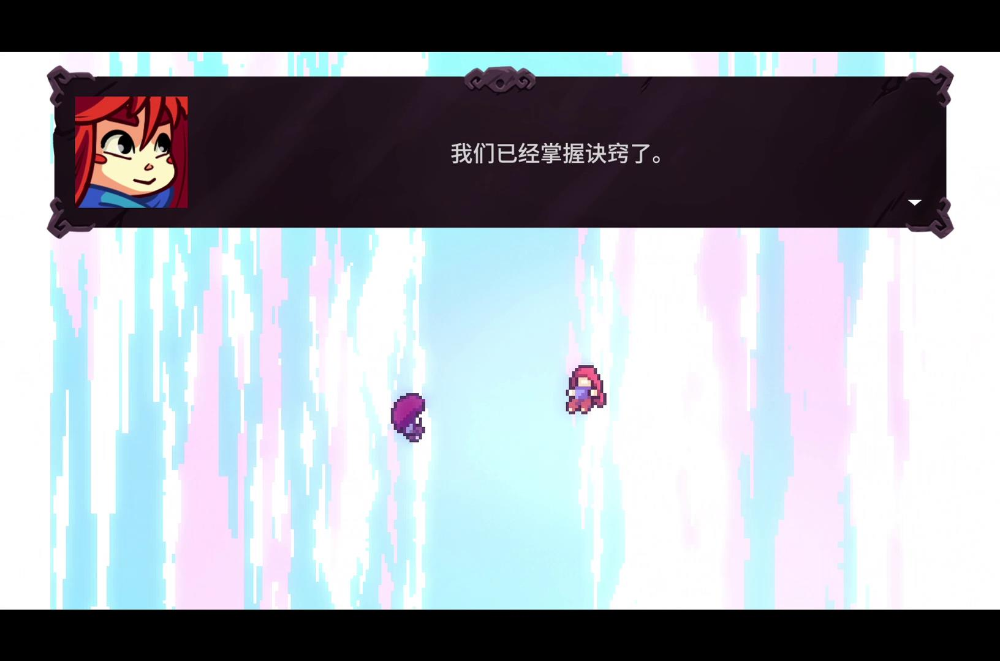

### 玩法
#### 1. 基础控制
游戏控制设计很简单，包括上下左右方向键，以及攀爬（z键）、突刺（x键）、跳跃（c键）。攀爬就是依附在墙等物体上，突刺只有在Madeline触碰了地面或者水晶之后才能使用一次。  
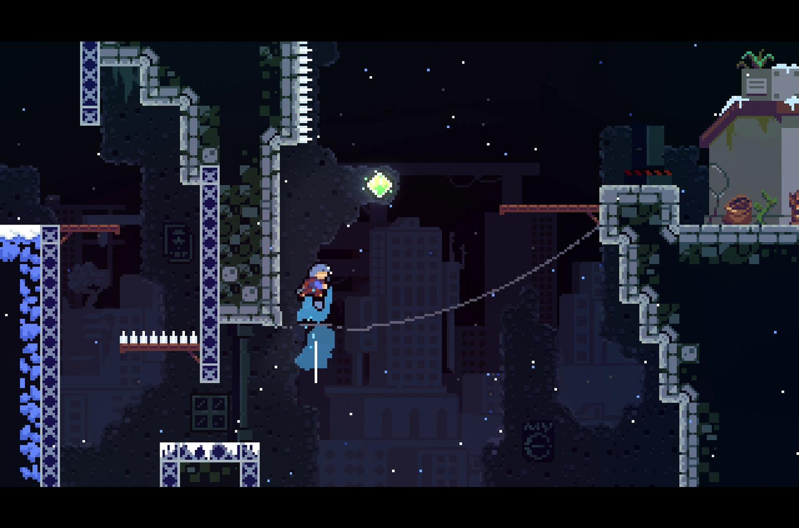

#### 2. 组合键
某些关卡需要Madeline利用墙壁等物体以及组合按键可以触发一些高阶动作，提高到达高度和前进距离，这些操作在整个游戏中都可以被触发，因此也可用来快速通关。  
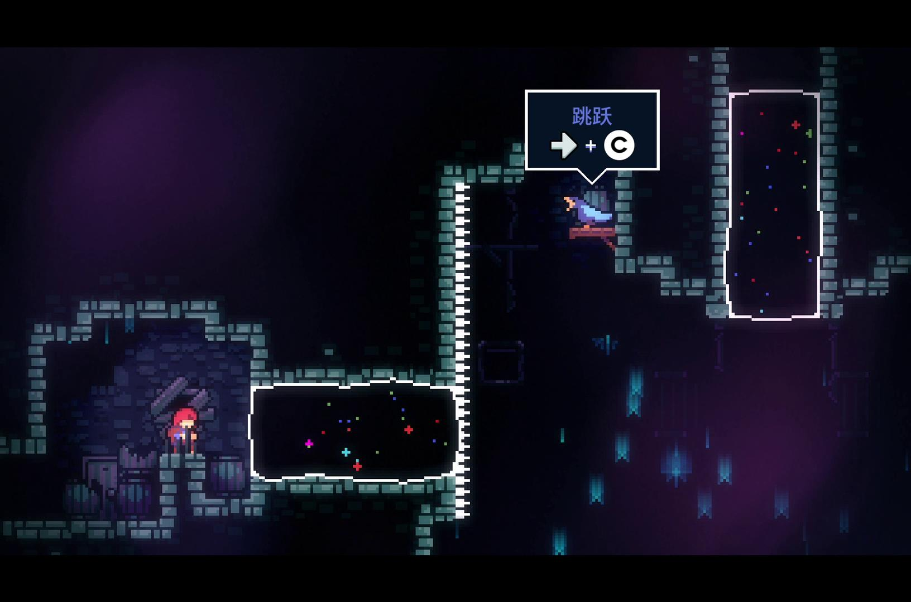

#### 3. 磁带关卡  
磁带关卡的设计结合了当前章节的环境设定以及一贯的节奏游戏风格。关卡中的蓝色和红色方块分别会随着音乐的节奏间隔消失和出现，因此玩家经常要算好节奏，犹豫就会败北。  
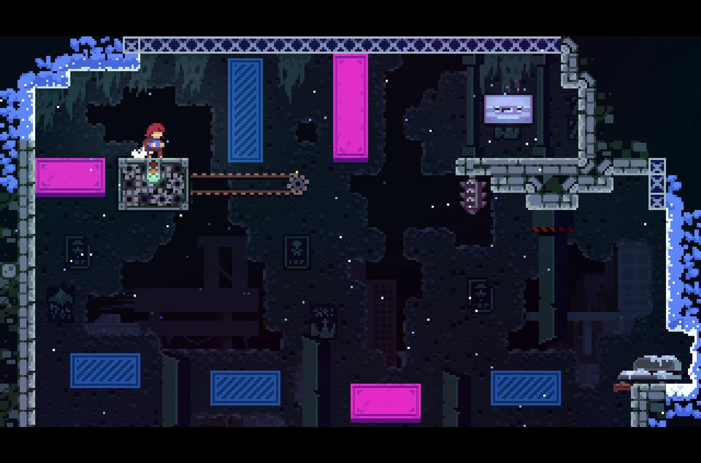

### 社会贡献与价值
这款游戏的画面、配乐、剧情，以及操作都值得探讨。它给玩家带来了一次丰富的体验，向人们直观地展示了抑郁症患者的内心困境是怎样的，启示人们应该包容自己的负面情绪，克服心魔，解决问题，十分有意义。

---
#### [返回目录](../Unity3dLearning-Catalog)