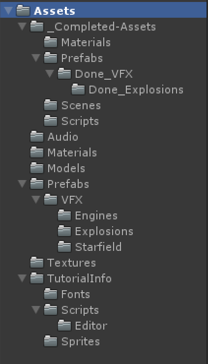
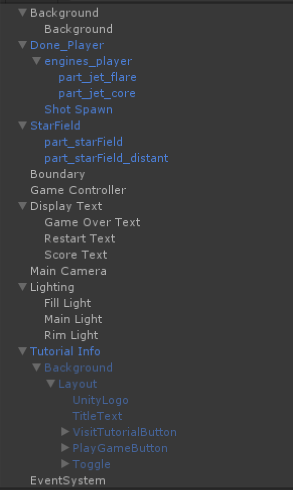
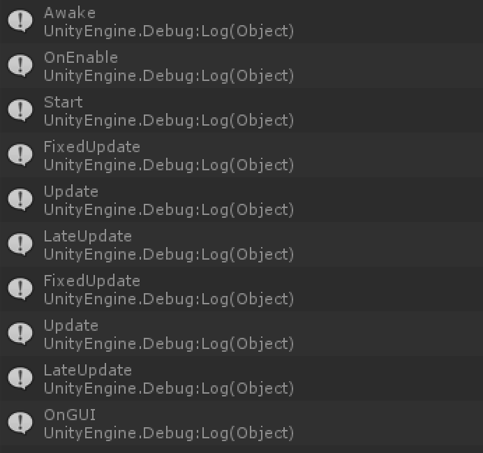
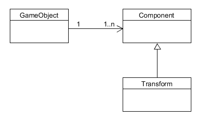
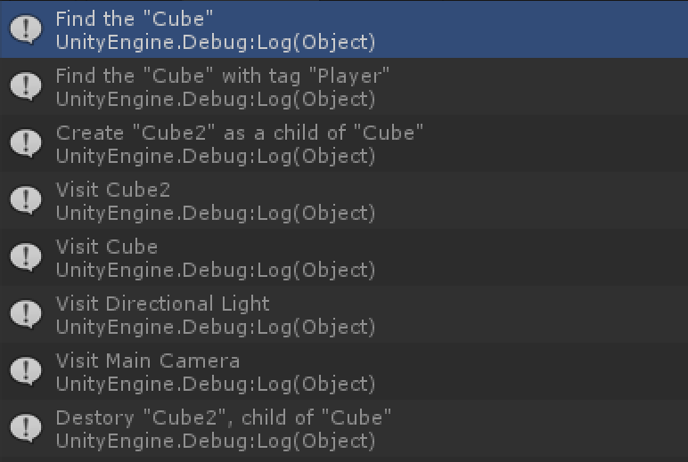
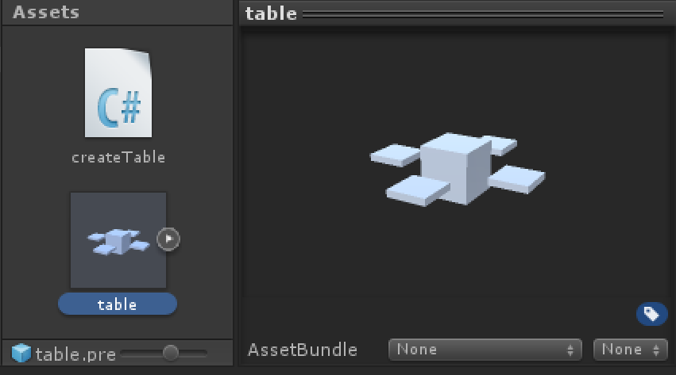
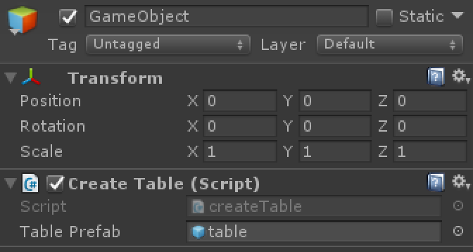
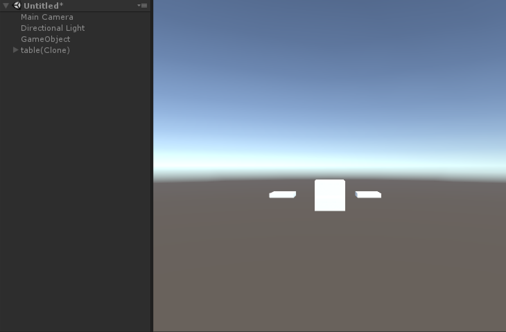
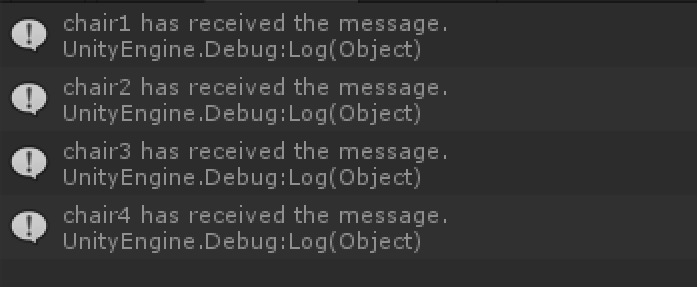

# Unity3d离散仿真引擎基础

## 简答题
1. ### 解释游戏对象（GameObjects）和资源（Assets）的区别与联系。
    * **[游戏对象](https://docs.unity3d.com/Manual/class-GameObject.html)：**   
    对象直接出现在游戏场景中，是资源整合的具体表现，包括人物，道具，场景等。
    * **[资源](https://docs.unity3d.com/Manual/AssetWorkflow.html)：**   
    资源是我们自定义的或者来自Unity外部的素材，如3D模型，音频，图片，预设，场景等，可以被对象使用，有些资源可以作为模板并实例化为游戏对象。
2. ### 下载几个游戏案例，分别总结资源、对象组织的结构（指资源的目录组织结构与游戏对象树的层次结构）
    以Space Shooter游戏的文件结构为例  
    * 资源的目录结构：包括预设、场景、特效、文本、脚本、场景、道具等，各种素材按照文件类型放置到不同文件夹中，方便资源整理和利用。  
    
    
    * 游戏对象树的层次：包括背景、人物主体、文本、灯光、人物控制器等各种游戏进行过程中必要的对象。  
    
3. ### 编写一个代码，使用 debug 语句来验证 [MonoBehaviour](https://docs.unity3d.com/ScriptReference/MonoBehaviour.html) 基本行为或事件触发的条件
    1. 基本行为包括 Awake() Start() Update() FixedUpdate() LateUpdate()
    2. 常用事件包括 OnGUI() OnDisable() OnEnable()
    
    * 代码

    ```
    using System.Collections;
    using System.Collections.Generic;
    using UnityEngine;

    public class NewBehaviourScript : MonoBehaviour {

        void Awake(){
            Debug.Log ("Awake");
        }

        // Use this for initialization
        void Start () {
            Debug.Log ("Start");
        }
        
        // Update is called once per frame
        void Update () {
            Debug.Log ("Update");
        }

        void FixedUpdate(){
            Debug.Log ("FixedUpdate");
        }

        void LateUpdate(){
            Debug.Log ("LateUpdate");
        }

        void OnGUI(){
            Debug.Log ("OnGUI");
        }

        void OnDisable(){
            Debug.Log ("OnDisable");
        }

        void OnEnable(){
            Debug.Log ("OnEnable");
        }
    }
    ```

    * 控制台输出  
    

4. ### 查找脚本手册，了解 [GameObject](https://docs.unity3d.com/ScriptReference/GameObject.html)，Transform，Component 对象
    1. 分别翻译官方对三个对象的描述（Description）
    * **[GameObject](https://docs.unity3d.com/Manual/class-GameObject.html)：** 游戏对象是Unity中最基础的表示人物，道具，场景对象。游戏对象本身并没有实现很多功能，真正实现功能的是组件（Component），而游戏对象是容纳组件的容器。  
    * **[Transform](https://docs.unity3d.com/Manual/class-Transform.html)：** 变换组件决定了对象再场景中的位置，旋转，角度。每个游戏对象都有一个变换组件。  
    * **[Components](https://docs.unity3d.com/Manual/UsingComponents.html)：** 组件是游戏对象的一部分，用于实现游戏对象的功能。  
    2. 描述下图中table对象（实体）的属性、table的Transform的属性、table的部件
        * 第一个选择框是activeSelf，可以定义对象的名字，动静态等属性。
        * 第二个选择框是Transform，可以定义对象的位置，旋转角度，缩放大小。
        * 第三个选择框是Mesh Filter，可以定义对象的模型。
        * 第四个选择框是Box Collider，可以调整坐标系原点的位置，大小。
        * 第五个选择框是Mesh Renderer，用于渲染模型，可以调节各种渲染效果。
        * 第六个选择框是Default-Material，可以调整对象的颜色，材质等。  
        
    3. 用UML图描述三者的关系  
        

5. ### 整理相关学习资料，编写简单代码验证以下技术的实现：
    1. 查找对象
    2. 添加子对象
    3. 遍历对象树
    4. 清除所有子对象

    * 代码

    ```
    using System.Collections;
    using System.Collections.Generic;
    using UnityEngine;

    public class NewBehaviourScript : MonoBehaviour {

        // Use this for initialization
        void Start(){
            //按名字查找
            var cubeFind = GameObject.Find ("Cube");
            if (null != cubeFind) {
                Debug.Log ("Find the \"Cube\"");
            } else {
                Debug.Log ("Did not find the \"Cube\"");
            }

            //按标签查找
            cubeFind = GameObject.FindGameObjectWithTag ("Player");
            if (null != cubeFind) {
                Debug.Log ("Find the \"Cube\" with tag \"Player\"");
            }
            else{
                Debug.Log("Did not find the \"Cube\" with tag \"Player\"");
            }

            //添加子对象
            GameObject cube2 = GameObject.CreatePrimitive(PrimitiveType.Cube);
            cube2.name = "Cube2";
            cube2.transform.position = new Vector3 (0, Random.Range(0,5), 5);
            cube2.transform.parent = this.transform;
            Debug.Log ("Create \"Cube2\" as a child of \"" + this.name + "\"");

            //遍历对象树
            GameObject[] objs = GameObject.FindObjectsOfType<GameObject>();
            foreach (GameObject obj in objs) {
                Debug.Log ("Visit " + obj.name);
            }

            //清除所有子对象
            foreach (GameObject obj in objs) {
                if(obj.transform.parent == this.transform){
                    Debug.Log ("Destory \""+ obj.name + "\", child of \"Cube\"");
                    GameObject.Destroy (obj);
                }
            }
        }
        
        // Update is called once per frame
        void Update () {
            
        }
    }
    ```

    * 控制台输出  
    
6. ### 资源预设（[Prefabs](https://docs.unity3d.com/Manual/Prefabs.html)）与 对象克隆 (clone)
    1. 预设（Prefabs）有什么好处？
        * 可以重复利用对象和资源，避免重新配置，提高效率
        * 对预设进行修改后，所有游戏对象也会发生相应改变
    2. 预设与对象克隆 (clone or copy or Instantiate of Unity Object) 关系？
        * 克隆对象首先要求场景中存在该对象，而使用预设可以在游戏运行时创建出场景中不存在的对象
        * 克隆出来的对象不会随着被克隆体的变化而变化，而使用预设创建的对象会在预设改变时发生改变
    3. 制作table预设，写一段代码将table预设资源实例化成游戏对象([教程](https://docs.unity3d.com/Manual/InstantiatingPrefabs.html))
        * 创建table预设  
            
        * 创建空对象  
        * 编写C#脚本，添加到创建的空对象中

        ```
        using System.Collections;
        using System.Collections.Generic;
        using UnityEngine;

        public class createTable : MonoBehaviour {

            public GameObject tablePrefab;

            // Use this for initialization
            void Start () {
                Instantiate (tablePrefab);
            }
            
            // Update is called once per frame
            void Update () {
                
            }
        }
        ```

        * 将空对象中脚本组件的tablePrefab属性值设置为创建好的table预设  
              
        * 运行  
              
7. ### 尝试解释组合模式（Composite Pattern/一种设计模式）。使用BroadcastMessage()方法，向子对象发送消息
    * 组合模式：组合模式又叫部分整体模式，它将对象组合成树形结构表现“整体-部分”的层次结构，使得用户可以以一致的方式处理单个对象或对象的组合。
    * 代码
    * table.cs 父对象

        ```
        using System.Collections;
        using System.Collections.Generic;
        using UnityEngine;

        public class table : MonoBehaviour {

            // Use this for initialization
            void Start () {
                this.BroadcastMessage ("answerParent");
            }
            
            // Update is called once per frame
            void Update () {
                
            }
        }
        ```
    * chair.cs 子对象

        ```
        using System.Collections;
        using System.Collections.Generic;
        using UnityEngine;

        public class chair : MonoBehaviour {

            // Use this for initialization
            void Start () {
                
            }
            
            // Update is called once per frame
            void Update () {
                
            }

            void answerParent(){
                Debug.Log (this.name + " has received the message.");
            }
        }
        ```

    * 控制台输出  
        

## 编程实践，小游戏

* 游戏内容：井字棋
* 技术限制：仅允许使用 **[IMGUI](https://docs.unity3d.com/Manual/GUIScriptingGuide.html)** 构建UI
* 作业目的： 
    * 提升debug能力
    * 提升阅读API文档能力
* 作业代码及报告地址：[https://github.com/guojj33/TicTacToe](https://github.com/guojj33/TicTacToe)