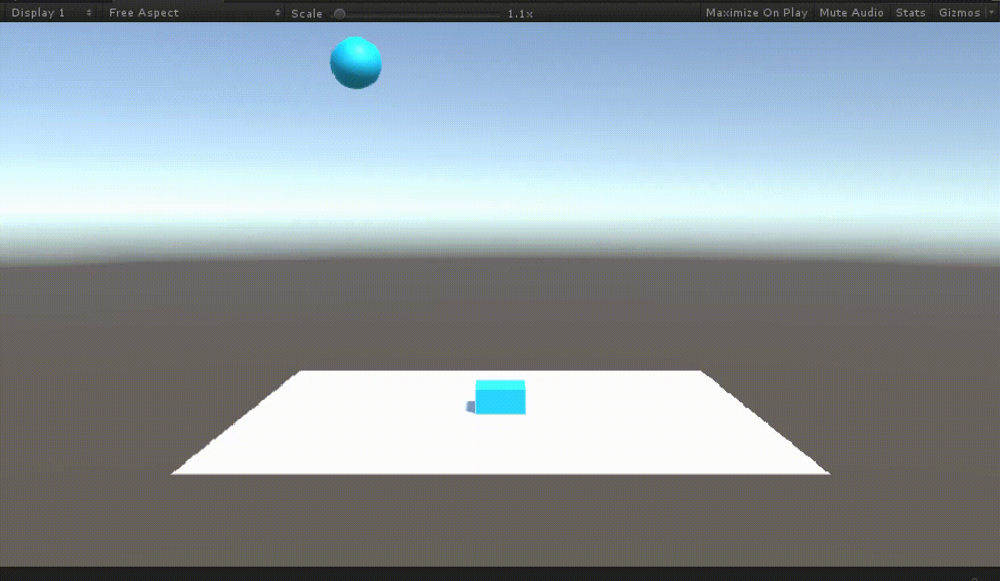
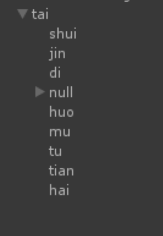
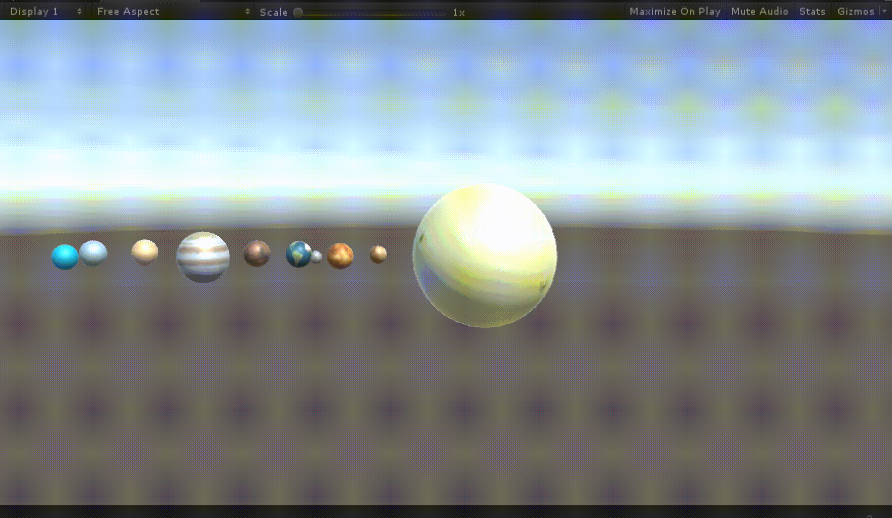

## 空间与运动
### [返回目录](../Unity3dLearning-Catalog)
---
## 操作演练
### 1. 游戏对象运动的本质是什么？
游戏对象的运动是游戏对象的控件属性，包括 transform 中的 position 和 rotation 属性，跟随每一帧的变化而实现的

### 2. 请用三种方法以上方法，实现物体的抛物线运动。（如，修改Transform属性，使用向量Vector3的方法…）
抛物线的特点是，水平方向速度不变，竖直方向速度均匀增加  


1. 改变 position  
```C#
using System.Collections;
using System.Collections.Generic;
using UnityEngine;

public class parabolicMotion : MonoBehaviour {
	public float speed = 0.1F;

	void Start () {

	}

	void Update () {
		if (this.transform.position.y > 0.5){
			this.transform.position += Vector3.down * Time.deltaTime * speed;
			this.transform.position += Vector3.right * Time.deltaTime * 5;
			speed += 0.1F;
		}
	}
}
```

2. 改写第一种方法，创建 Vector3  
```C#
using System.Collections;
using System.Collections.Generic;
using UnityEngine;

public class parabolicMotion : MonoBehaviour {
	public float speed = 0.1F;

	void Start () {

	}

	void Update () {
		if (this.transform.position.y > 0.5){
			this.transform.position += new Vector3(Time.deltaTime * 5, -Time.deltaTime*speed, 0);
			speed += 0.1F;
		}
	}
}
```

3. 改写第二种方法，调用 Translate 函数  
```C#
using System.Collections;
using System.Collections.Generic;
using UnityEngine;

public class parabolicMotion : MonoBehaviour {
	public float speed = 0.1F;

	void Start () {

	}

	void Update () {
		if (this.transform.position.y > 0.5){
			transform.Translate(new Vector3(Time.deltaTime * 5, -Time.deltaTime*speed, 0));
			speed += 0.1F;
		}
	}
}
```

### 3. 写一个程序，实现一个完整的太阳系， 其他星球围绕太阳的转速必须不一样，且不在一个法平面上。
按照水金地、火木土、天王、海王的顺序排列，并作为太阳的子对象。通过 RotateAround() 实现公转， Rrotate() 实现自转。  
由于地球在自传，所以直接将月球作为地球的子对象，将会影响月球对地球的公转。因此需要创建一个空对象，与地球具有相同的公转行为，但不自转，然后让月球作为空对象的子对象并围绕空对象公转，这样就能呈现月球围绕地球转的“假象”。  
  
```C#
using System.Collections;
using System.Collections.Generic;
using UnityEngine;

public class solar : MonoBehaviour {

	// Use this for initialization
	void Start () {
		
	}
	
	// Update is called once per frame
	void Update () {
		GameObject.Find("shui").transform.RotateAround(Vector3.zero, new Vector3(0.1F, 1, 0), 30 * Time.deltaTime);
		GameObject.Find("shui").transform.Rotate(Vector3.up * Time.deltaTime * 10000);
		GameObject.Find("jin").transform.RotateAround(Vector3.zero, new Vector3(0, 1, 0.1F), 40 * Time.deltaTime);
		GameObject.Find("jin").transform.Rotate(Vector3.up * Time.deltaTime * 10000);
		
		GameObject.Find("di").transform.RotateAround(Vector3.zero, new Vector3(0, 1.1F, 0), 20 * Time.deltaTime);
		GameObject.Find("di").transform.Rotate(Vector3.up * Time.deltaTime * 10000 * 0.01F);
		GameObject.Find("null").transform.RotateAround(Vector3.zero, new Vector3(0, 1.1F, 0), 20 * Time.deltaTime);

		GameObject yue = GameObject.Find("yue");
		Vector3 diPos = yue.transform.parent.position;
		yue.transform.RotateAround(diPos, Vector3.up, 500 * Time.deltaTime);

		GameObject.Find("huo").transform.RotateAround(Vector3.zero, new Vector3(0.12F, 1, 0), 25 * Time.deltaTime);
		GameObject.Find("huo").transform.Rotate(Vector3.up * Time.deltaTime * 10000);
		GameObject.Find("mu").transform.RotateAround(Vector3.zero, new Vector3(0, 1, 0.12F), 35 * Time.deltaTime);
		GameObject.Find("mu").transform.Rotate(Vector3.up * Time.deltaTime * 10000);
		GameObject.Find("tu").transform.RotateAround(Vector3.zero, new Vector3(0, 1.12F, 0), 25 * Time.deltaTime);
		GameObject.Find("tu").transform.Rotate(Vector3.up * Time.deltaTime * 10000);
		GameObject.Find("tian").transform.RotateAround(Vector3.zero, new Vector3(0.11F, 1, 0), 15 * Time.deltaTime);
		GameObject.Find("tian").transform.Rotate(Vector3.up * Time.deltaTime * 10000);
		GameObject.Find("hai").transform.RotateAround(Vector3.zero, new Vector3(0, 1, 0.11F), 28 * Time.deltaTime);
		GameObject.Find("hai").transform.Rotate(Vector3.up * Time.deltaTime * 10000);
	}
}
```

## 编程实践
### 牧师与魔鬼 Priests And Devils
<a href = "https://github.com/guojj33/Unity3DLearning/tree/master/HW3" target = "_blank">传送门</a>

---

#### [返回目录](../Unity3dLearning-Catalog)


