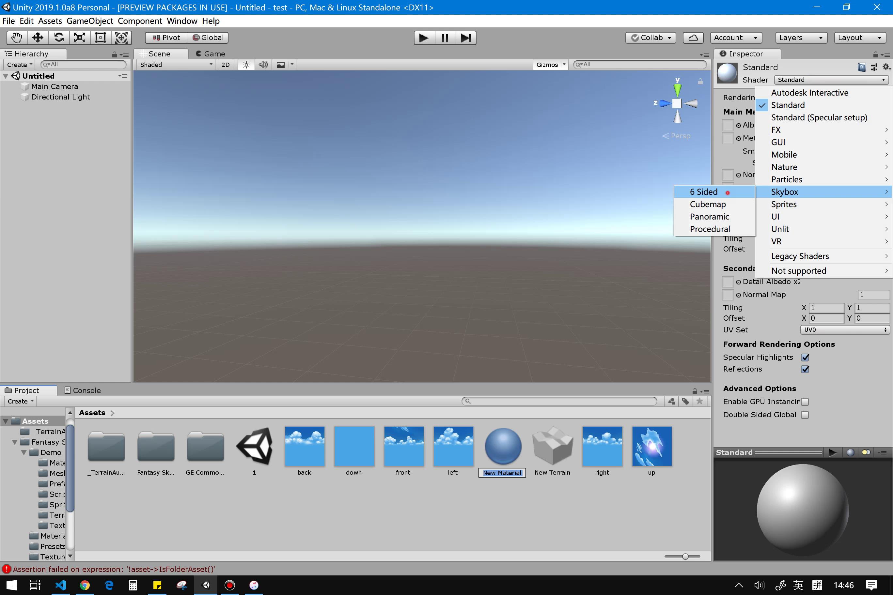

## 空间与运动
### [返回目录](../Unity3dLearning-Catalog)
---
## 操作演练
### 1.下载 Fantasy Skybox FREE， 构建自己的游戏场景
- 从 Window -> Asset Store 下载 Fantasy Skybox FREE 并导入
- 从素材创建天空盒
  1. 创建 Material
    
  2. 将 Shader 设置为 Skybox -> 6 Sided
    
  3. 将天空图片对应拖到材质的 6 个面
    
  4. 将材质拖到场景中
    
- 创建绘制地形  
    创建游戏对象 Terrain 。Terrain 组件可以绘制地形，绘制树目，绘制草地。在每个功能中又有多种工具。如绘制地形中具有增减高度，平滑高度，更换地形贴图等工具。  
    
    最终成品  
    
### 2.写一个简单的总结，总结游戏对象的使用
主要的游戏对象有  
- 摄像机、灯光、效果、音频等非实体对象  
- 3D物体等实体对象  
- 特殊对象空对象  
游戏对象可以直接创建也可以通过脚本动态创建，通过添加和调用游戏对象的组件可以实现对象功能。  

## 编程实践
### 牧师与魔鬼（动作分离版）
<a href = "https://github.com/guojj33/Unity3DLearning/tree/master/HW4" target = "_blank">传送门</a>

---

#### [返回目录](../Unity3dLearning-Catalog)